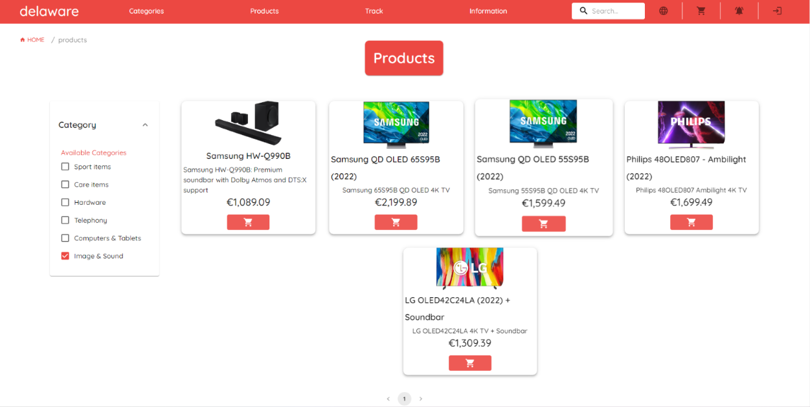
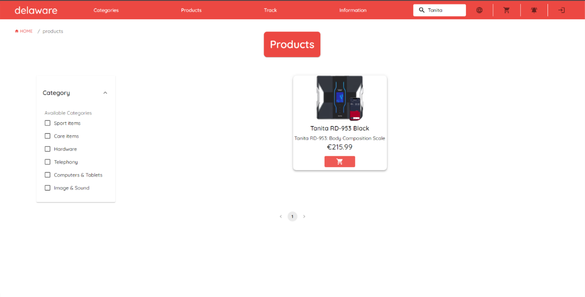

# Webshop-frontend
This is the frontend of a webshop that was made for Delaware as a student project.

This project is made using ReactJS, styling is done with MaterialUI.

Check out the online version [here](https://dws.qwict.com)

## Some images

### Homepage

### Categories

### Products

Filter

Search

### Cart

### Placing an order

### Notifications

### Orders

### Account

### Contact

